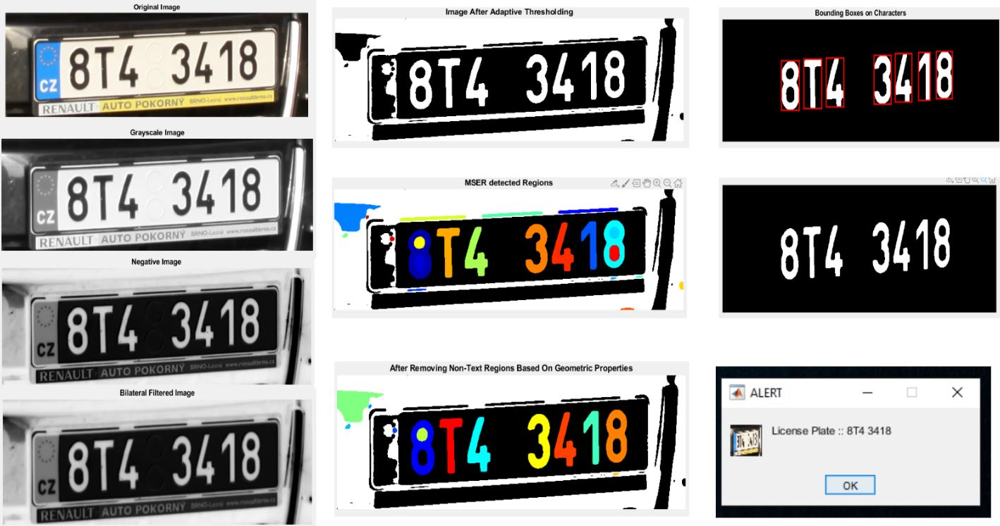

# VLP-Text-Extraction-Model

####  Developed a model in MATLAB which will extract text from Vehicle License Plates.

## Model Design:

1. Convert of Input Image to Black and White Image.
2. Convert B&W Image to Negative Image
3. Apply Bilateral filter for Image Smoothening
4. Apply Adaptive Thresholding (in order to segregate background and foreground)
5. Image Cleaning by removing objects having pixel < 100
6. Using MSER (Maximally Stable Extremal Regions) for text detection.
7. Removal of Non-Text regions using geometric properties of Image
8. Create Bounding Boxes around the text region
9. Extract Text using OCR
10. Alert Pop up with the license Plate number.

## Example:

